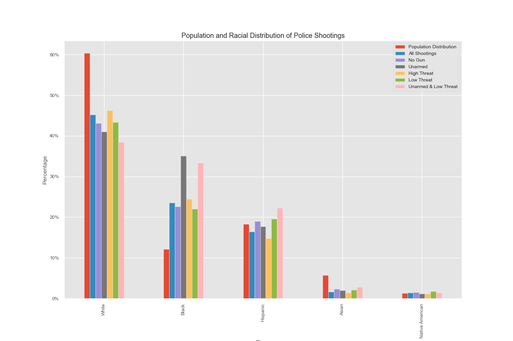

# Analysis of [Washington Post Police Shootings Database](https://www.washingtonpost.com/graphics/investigations/police-shootings-database/?fbclid=IwAR2fL1sAdoin_qgMTGZ5P7OkzedD1rZTs8FWn4UOTBwfKjPqE8PFSfpUEgM)
## Background
"In 2015, The Washington Post began to log every fatal shooting by an on-duty police officer in the United States. In that time there have been more than 5,000 such shootings recorded by The Post."

While WaPo provides an interactive tool for navigating this data, it lacks broader context for interpreting the data properly. Specifically, as Bayesian Logic dictates, results must factor in each race's representation in the population. As such, Census data from 2018 was used to approximate an average population distribution from 2015-2020. 

## Methodology
If the percentage of police shootings for a given race exceeds its representation in the population, it is an indication that the racial group is disproportionately targeted in police shootings. The reverse would also be true.

We look at the results in various scenarios:

- All Police Shootings
- Suspect Has No Gun
- Suspect is Completely Unarmed
- Suspect is Deemed High Threat
- Suspect is Deemed Low Threat

The Washington Post defines "attack" threat (defined here as "High Threat" to simplify interpretability) as: "incidents where officers or others were shot at, threatened with a gun, attacked with other weapons or physical force, etc." All other incidents are classified as "Low Threat."

## Initial Results
From the chart below, we can clearly see that the black community is disproportionally shot fatally by police than we should expect, given their representation in the population. This disparity is most pronounced when the suspect is **Unarmed** or **Unarmed & Low Threat**, where blacks are represented nearly 3 times greater than would be expected.

In all cases, whites and Asians are underrepresented, while Hispanic, Native American, and other populations match expectations.
